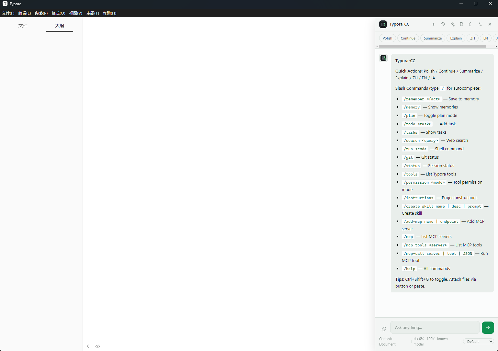

# Typora-CC

<p align="center">
  
</p>

<p align="center">
  <strong>一个用于 Typora 的 Codex 风格 AI 助手。</strong>
</p>

<p align="center">
  文档上下文 · Markdown 编辑工具 · Skills · MCP · 多模型支持
</p>

<p align="center">
  <a href="README.md">English</a>
</p>

## Typora-CC 是什么？

Typora-CC 是一个 Typora AI 助手插件。它会在 Typora 中加入一个侧边栏对话界面，可以理解当前 Markdown 文档、选中文本和项目文件夹。

它适合经常在 Typora 中写作、阅读、总结、翻译、润色和整理 Markdown 笔记或论文的人。相比普通聊天机器人，它更贴近编辑器本身，可以直接围绕文档工作。

Typora-CC 可以：

- 解释当前文档；
- 润色或翻译选中文本；
- 生成 Markdown 表格和 LaTeX 公式；
- 将 AI 输出插入回 Typora；
- 通过结构化工具调用操作文档；
- 导入可复用 Skills；
- 连接 MCP 服务；
- 使用 OpenAI 兼容模型服务。

## 功能亮点

- **为 Typora 设计**：悬浮按钮、侧边栏、快捷操作、选中文本引用、直接插入。
- **上下文模式**：`Document`、`Folder`、`None`。
- **Markdown 渲染**：标题、列表、表格、代码块、行内公式和块级公式。
- **本地 Markdown 工具**：`typora_tool` 可以改写选中文本、在光标处插入、patch Markdown 文件、读写 `.md` 文件。
- **权限控制**：`Default`、`Audit`、`Full Access`，显示在输入框下方和设置面板中。
- **Skills**：内置技能，支持 JSON、ZIP 和 Codex/Claude 风格 `SKILL.md` 导入。
- **MCP 集成**：添加 MCP 服务、列出工具、执行 MCP 调用。
- **多模型支持**：OpenAI、Anthropic、DeepSeek、Ollama 和自定义 OpenAI 兼容端点。
- **上下文管理**：识别模型上下文窗口，估算 token，并对旧对话进行压缩，而不是直接截断。

## 截图

- 显示效果

<p align="center">
  
</p>

## 安装

### Windows：双击安装

这是 Windows 上推荐的安装方式。

1. 下载或克隆本仓库。
2. 打开项目文件夹。
3. 双击 `install.bat`。
4. 重启 Typora。
5. 按 `Ctrl+Shift+G`，或点击 Typora-CC 悬浮按钮。

如果你的 Typora 不在 `E:\Typora`，请先修改 `install.ps1`：

```powershell
$typoraDir = 'E:\Typora'
```

改成你的 Typora 安装目录，例如：

```powershell
$typoraDir = 'C:\Program Files\Typora'
```

也可以手动运行安装脚本：

```powershell
powershell -NoProfile -ExecutionPolicy Bypass -File .\install.ps1
```

### Windows：手动安装

将文件复制到 Typora resources 目录：

```text
<Typora安装目录>\resources\typora-gpt\
├── loader.js
└── plugin\
```

然后编辑：

```text
<Typora安装目录>\resources\window.html
```

在 `</body>` 前加入：

```html
<!-- Typora-CC Plugin -->
<script src="./typora-gpt/loader.js"></script>
```

重启 Typora。

### macOS：双击 / 图形化安装

这是 macOS 上推荐的安装方式。

1. 下载或克隆本仓库。
2. 右键 `install.command` > **打开**。第一次运行时 macOS 可能会要求确认。
3. 重启 Typora。
4. 按 `Ctrl+Shift+G`，或点击 Typora-CC 悬浮按钮。

如果 macOS 提示文件不可执行，先运行一次：

```bash
chmod +x install.command
```

然后再双击运行。

> 如果 Typora 安装在其他位置，运行前设置路径：
>
> ```bash
> TYPORA_RES=/path/to/Typora.app/Contents/Resources ./install.command
> ```

### macOS：手动安装

不同版本 Typora 的路径可能略有不同。

1. 打开 Typora 应用资源目录，常见路径：

```text
/Applications/Typora.app/Contents/Resources/
```

2. 创建目录：

```text
/Applications/Typora.app/Contents/Resources/typora-gpt/
```

3. 复制文件：

```bash
cp loader-embedded.js /Applications/Typora.app/Contents/Resources/typora-gpt/loader.js
cp -R plugin /Applications/Typora.app/Contents/Resources/typora-gpt/plugin
```

4. 编辑：

```text
/Applications/Typora.app/Contents/Resources/window.html
```

在 `</body>` 前加入：

```html
<!-- Typora-CC Plugin -->
<script src="./typora-gpt/loader.js"></script>
```

5. 重启 Typora。

> 注意：编辑 `/Applications` 下的文件可能需要管理员权限。Typora 更新后可能需要重新安装插件。

### Linux：双击 / 图形化安装

大多数 Linux 桌面环境可以从文件管理器运行可执行 `.sh` 文件。

1. 下载或克隆本仓库。
2. 添加可执行权限：

```bash
chmod +x install-linux.sh
```

3. 从文件管理器双击运行，或在终端执行：

```bash
./install-linux.sh
```

4. 重启 Typora。
5. 按 `Ctrl+Shift+G`，或点击 Typora-CC 悬浮按钮。

> 如果你的 Typora resources 目录不同：
>
> ```bash
> TYPORA_RES=/opt/Typora/resources ./install-linux.sh
> ```

### Linux：手动安装

Typora resources 路径取决于安装方式。

常见路径：

```text
/usr/share/typora/resources/
/opt/Typora/resources/
```

安装示例：

```bash
cd Typora-CC
sudo mkdir -p /usr/share/typora/resources/typora-gpt
sudo cp loader-embedded.js /usr/share/typora/resources/typora-gpt/loader.js
sudo cp -R plugin /usr/share/typora/resources/typora-gpt/plugin
```

然后编辑：

```text
/usr/share/typora/resources/window.html
```

在 `</body>` 前加入：

```html
<!-- Typora-CC Plugin -->
<script src="./typora-gpt/loader.js"></script>
```

重启 Typora。

如果你的 Typora resources 目录不是 `/usr/share/typora/resources/`，请替换成实际路径。

## 配置

从 Typora-CC 侧边栏打开设置。

### 模型服务

支持的服务模式：

| Provider  | Endpoint 示例                                    | 说明            |
| --------- | ------------------------------------------------ | --------------- |
| OpenAI    | `https://api.openai.com/v1/chat/completions`   | OpenAI 官方 API |
| Anthropic | `https://api.anthropic.com/v1/messages`        | Claude 模型     |
| DeepSeek  | `https://api.deepseek.com/v1/chat/completions` | OpenAI 兼容     |
| Ollama    | `http://localhost:11434/v1/chat/completions`   | 本地模型        |
| Custom    | 任意 OpenAI 兼容端点                             | 代理或其他服务  |

对于 OpenAI 兼容服务，可以只输入基础路径：

```text
https://api.example.com/v1
```

Typora-CC 会自动补全为：

```text
https://api.example.com/v1/chat/completions
```

### 模型上下文

Typora-CC 会尝试检测或推断：

- 上下文窗口；
- 最大输出 token；
- 是否支持视觉能力。

当对话过长时，会将旧消息压缩成摘要，而不是简单截断。

### 工具权限

工具权限显示在输入框下方和设置面板中。

| 模式            | 行为                             |
| --------------- | -------------------------------- |
| `Default`     | 只读工具自动执行，写工具需要确认 |
| `Audit`       | 所有工具调用都需要确认           |
| `Full Access` | 工具调用无需确认                 |

也可以使用命令切换：

```text
/permission default
/permission audit
/permission full
```

## 功能详解

### 1. 对话侧边栏

- `Ctrl+Shift+G` 打开或关闭。
- 侧边栏关闭时显示悬浮按钮。
- 支持流式响应。
- 支持复制和插入回复。
- 支持历史会话。
- 侧边栏宽度可拖拽调整。

### 2. 上下文模式

| 模式         | 发送内容                     |
| ------------ | ---------------------------- |
| `Document` | 当前 Markdown 文档           |
| `Folder`   | 当前文件夹中的 Markdown 文件 |
| `None`     | 不发送文档上下文，仅聊天     |

选中文本也会被识别，可以作为更聚焦的上下文。

### 3. 快捷操作

输入框上方的快捷按钮：

- Polish
- Continue
- Summarize
- Explain
- 翻译为中文
- 翻译为英文
- 翻译为日文

### 4. Markdown 和 LaTeX 输出

Typora-CC 支持渲染：

- Markdown 标题；
- 列表；
- 表格；
- 引用；
- 代码块；
- 行内代码；
- 链接；
- 行内公式；
- 块级公式。

内置 Markdown + LaTeX 格式化技能，适合规范公式输出，例如：

```latex
$$
L_{total} = \lambda_{cls} L_{cls} + \lambda_{feat} L_{feat}
$$
```

### 5. 本地文档工具

模型可以通过 fenced `typora_tool` 代码块请求本地操作：

````md
```typora_tool
{"tool":"replaceSelection","arguments":{"text":"新的 Markdown 内容"}}
```
````

可用工具：

| Tool                       | 说明                              | 写入 |
| -------------------------- | --------------------------------- | ---- |
| `getCurrentMarkdown`     | 获取当前文档内容                  | 否   |
| `getSelectedText`        | 获取选中文本                      | 否   |
| `replaceSelection`       | 替换选中文本                      | 是   |
| `insertAtCursor`         | 在光标处插入                      | 是   |
| `replaceCurrentDocument` | 替换当前文档内容                  | 是   |
| `saveCurrentDocument`    | 请求 Typora 保存当前文档          | 是   |
| `readMarkdownFile`       | 读取 Markdown/text 文件           | 否   |
| `writeMarkdownFile`      | 写入 Markdown/text 文件           | 是   |
| `patchMarkdownFile`      | 查找并替换 Markdown/text 文件内容 | 是   |
| `listMarkdownFiles`      | 列出文件夹中的 Markdown/text 文件 | 否   |

文件写入工具会在写入前创建 `.bak` 备份。

### 6. Skills

Typora-CC 支持：

- 内置 skills；
- 自定义 JSON skills；
- ZIP 导入；
- Codex/Claude 风格 skill 文件夹：

```text
my-skill/
└── SKILL.md
```

导入的 skills 会在与用户任务相关时自动加入模型上下文。

### 7. MCP

可以通过设置或斜杠命令添加 MCP 服务。

常用命令：

```text
/add-mcp name | endpoint | apiKey
/mcp
/mcp-tools <server>
/mcp-call server | tool | {"arg":"value"}
```

模型也可以输出 `mcp_call` block，Typora-CC 会执行并将结果追加到对话中。

### 8. 斜杠命令

在输入框输入 `/` 打开命令面板。

| 命令                    | 说明            |
| ----------------------- | --------------- |
| `/remember <fact>`    | 保存记忆        |
| `/memory`             | 查看记忆        |
| `/forget all`         | 清空记忆        |
| `/plan`               | 切换计划模式    |
| `/todo <task>`        | 添加任务        |
| `/tasks`              | 查看任务        |
| `/search <query>`     | 搜索网页        |
| `/run <cmd>`          | 执行 shell 命令 |
| `/git`                | 查看 Git 状态   |
| `/status`             | 查看运行状态    |
| `/tools`              | 查看本地工具    |
| `/permission <mode>`  | 设置工具权限    |
| `/instructions`       | 查看项目说明    |
| `/create-skill name     | desc            |
| `/add-mcp name          | endpoint`       |
| `/mcp`                | 查看 MCP 服务   |
| `/mcp-tools <server>` | 查看 MCP 工具   |
| `/mcp-call server       | tool            |

## 项目结构

```text
Typora-CC/
├── plugin/
│   ├── context.js       # 文档和文件夹上下文
│   ├── features.js      # 斜杠命令、记忆、搜索、Git、任务
│   ├── history.js       # 会话历史
│   ├── llm.js           # 模型服务和上下文压缩
│   ├── media.js         # 附件、图片、OCR
│   ├── skills.js        # Skills 和 MCP
│   ├── tools.js         # Typora/Markdown 本地工具
│   ├── ui.js            # 侧边栏 UI
│   ├── writing.js       # Prompt 编排
│   └── css/
├── loader-embedded.js
├── loader.js
├── install.bat           # Windows 启动器
├── install.ps1           # Windows 安装脚本
├── install.command       # macOS 安装脚本
├── install-linux.sh      # Linux 安装脚本
└── uninstall.bat
```

## 开发

Typora-CC 是原生 JavaScript，没有构建步骤。

语法检查：

```powershell
node --check plugin\ui.js
node --check plugin\tools.js
node --check plugin\llm.js
```

修改后重新安装：

```powershell
powershell -NoProfile -ExecutionPolicy Bypass -File .\install.ps1
```

然后重启 Typora。

## 常见问题

### 侧边栏没有出现

- 重启 Typora。
- 检查 `window.html` 是否包含：

```html
<script src="./typora-gpt/loader.js"></script>
```

- 检查文件是否存在：

```text
Typora/resources/typora-gpt/plugin/
```

### API 无法使用

- 检查 API Key。
- 检查 Endpoint。
- 使用设置面板里的 `Test`。
- 自定义服务需要支持 OpenAI-compatible chat completions。

### 工具调用没有执行

- 检查权限模式。
- 使用 `/tools` 查看工具列表。
- `Default` 模式下写工具需要确认。
- 文件工具只允许 Markdown/text 类型文件。

## Roadmap

- 更好的文档工具 diff 预览
- 更稳定的 Typora 保存集成
- 跨平台安装器
- 发布版打包
- 更多内置 skills

## 贡献

欢迎贡献代码、文档和问题反馈。

1. Fork 本仓库。
2. 创建功能分支。
3. 保持改动聚焦。
4. 在 Typora 中测试。
5. 提交 Pull Request，必要时附截图或复现步骤。

## 鸣谢

- [mnbvcxzz1375 (Yecheng He)](https://github.com/mnbvcxzz1375) — 作者 & 维护者
- [Typora](https://typora.io/) — Markdown 编辑器
- [obsidian42-brat](https://github.com/TfTHacker/obsidian42-brat)
- [claude-code](https://github.com/claude-code-best/claude-code)
- [zotero-gpt](https://github.com/MuiseDestiny/zotero-gpt)
- [zotero-style](https://github.com/MuiseDestiny/zotero-style)
- [Best README template](https://github.com/shaojintian/Best_README_template)

## 开源协议

MIT
